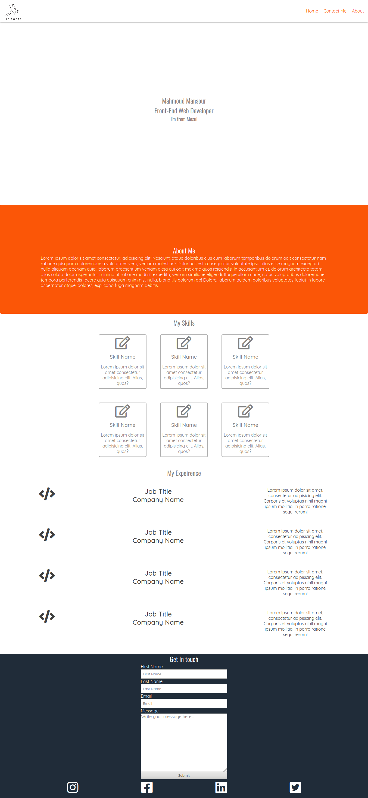

# bootcamp-iraq-2020-apr-css-flexbox-excercise
I bult the page from scratch take a look at it and give me your feedback and comments
This is a few notes for the reviewer:

1. navbar links works and lead you to different sections on the same page and this links has hover effect

2.there is hover effect on the skills section

3. socail media links has hover effects and it leads you to soical media homepag

4. Fonts used here 'Oswald' for the headers and 'Quicksand' for the other parts of the layout

This is a full screenshot for the page:
